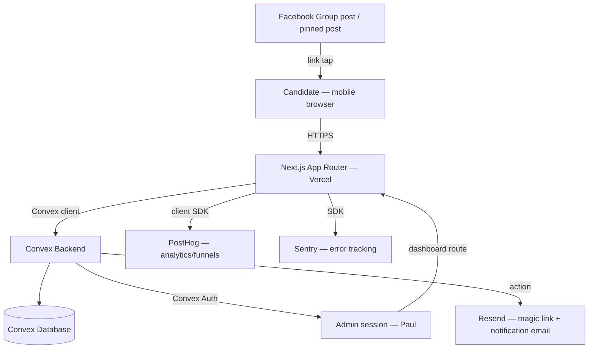

# PRD — EU Fit Check

## 1. Overview

### Product Summary

**EU Fit Check** gives Thai professionals an honest, coach-informed first read on their EU job-market readiness — before they spend a baht on coaching. It replaces PunProfile Career Coaching's current 6-question quiz + 25-question Google Form lead-qualification funnel with a single, mobile-first, progressive web app that produces an instant self-report "spider chart" of readiness, while simultaneously creating a qualified, nurturable lead record for PunProfile.

### Objective

This PRD covers the MVP defined in `product-vision.md` § 3 Product Strategy → MVP Definition: a progressive, mobile-first questionnaire with a relocation-pathway selector; a staged teaser-before-ask reveal; a clearly-labeled self-report spider chart; progressive contact capture with PDPA-compliant consent; partial-lead creation the moment minimum contact info exists; magic-link save/resume; and a coach-facing lead dashboard. Everything in `product-vision.md` § 3 → Explicitly Out of Scope (full ECRA replication, education-matchmaker, cold/warm entry variants, multi-country benchmarking, LINE nurture automation, Blockdit/Pantip channels) is out of scope for this build.

### Market Differentiation

The implementation must deliver two things simultaneously or the differentiation collapses: (1) a teaser chart segment that renders from real self-reported data within roughly a minute of landing, with zero contact-info gate before it — this is what separates EU Fit Check from the current slow Form; and (2) explicit, impossible-to-miss "self-reported, preliminary" labeling on every score shown — this is what separates it from generic quizzes that fake precision. Both must hold even on a mid-range Android phone on a mediocre mobile connection, since that's the realistic device/network profile for this audience.

### Magic Moment

The magic moment is seeing part of the spider chart render, visually, within about a minute of starting — before any email or contact info is requested. Technically this means: the first question set must be answerable with taps only (no free text), the chart-segment calculation must run client-side or in a fast Convex query with no cold-start lag, and the chart component must render meaningfully with partial data (not wait for all dimensions to have scores before showing anything).

### Success Criteria

- Time from landing to first teaser chart render: **< 60 seconds** for a user answering at a normal pace.
- Teaser chart renders correctly with as few as 1 of 4 assessment dimensions populated.
- Page load (LCP) **< 2.5s on 3G-equivalent throttling**, since this audience is disproportionately mobile-only.
- 100% of P0 functional requirements (§ 6) implemented and manually verified on both a real mobile device and desktop before launch.
- Zero contact-info fields requested before the teaser chart has rendered at least once.

---

## 2. Technical Architecture

### Architecture Overview



### Chosen Stack

| Layer | Choice | Rationale |
|---|---|---|
| Frontend | Next.js (App Router) | Deploys natively to Vercel with zero config; deepest AI-coding-agent training support, minimizing what a non-technical founder has to hand-maintain. |
| Backend | Convex | Zero backend boilerplate, generous free tier, real-time reactivity fits the save-as-you-go progressive profiling requirement directly. |
| Database | Convex Database | Included with the backend; reactive queries suit the lead/partial-completion data model without separate relational infrastructure. |
| Auth | Convex Auth | Single admin login (Paul) for the lead dashboard; candidates use a passwordless magic link, not a real account. |
| Analytics | PostHog | Free tier covers expected volume; funnel/drop-off tracking answers where people abandon the staged flow. |
| Email | Resend | Sends magic links, delivers the self-report result, and notifies Paul of new leads. |
| Error tracking | Sentry | Free tier; catches production issues a non-technical, intermittently-available founder wouldn't otherwise notice. |

Payments row omitted — revenue model is Free; no payment integration in this product (see § 10, skipped).

### Stack Integration Guide

**Setup order:**
1. `npx create-next-app@latest` (App Router, TypeScript, Tailwind — Tailwind because it's the fastest path to consuming `docs/design.md` tokens once that file exists).
2. `npm install convex` and run `npx convex dev` to scaffold the `convex/` directory and get a deployment URL.
3. Install `@convex-dev/auth` and follow its Next.js App Router setup guide to wire Convex Auth for a single admin account (Paul's email, provisioned directly — no public sign-up flow needed since there's exactly one admin user).
4. Install `resend` for the email actions; store `RESEND_API_KEY` as a Convex environment variable (`npx convex env set RESEND_API_KEY ...`), since email-sending actions run in Convex, not in Next.js API routes.
5. Install `posthog-js` for the frontend and initialize it in a client-side provider component wrapping the app.
6. Install `@sentry/nextjs` and run its setup wizard (`npx @sentry/wizard@latest -i nextjs`) to generate the standard client/server/edge config files.

**Known gotchas:**
- Convex mutations are the only place data should be written; never write directly from a client action to bypass validation — especially important here since lead data includes PII.
- Magic-link tokens must be generated server-side (in a Convex mutation) using a cryptographically random value (e.g. `crypto.randomUUID()` is not sufficient on its own for security-sensitive tokens — use a longer random string, e.g. via `crypto.getRandomValues`), never a predictable value like a timestamp or incrementing ID.
- Convex Auth's admin session and the candidate's magic-link access are two entirely separate mechanisms — do not let them share a cookie/session namespace, to avoid a candidate's magic link ever being usable to reach the admin dashboard.
- PostHog and Sentry must both be configured to **not** capture PII by default (see Security Considerations below) — this requires explicit config, not the library defaults.

**Required environment variables:**
- `NEXT_PUBLIC_CONVEX_URL` — Convex deployment URL (public, safe for client)
- `CONVEX_DEPLOY_KEY` — for CI/CD deploys (server-only)
- `RESEND_API_KEY` — Convex environment variable, not exposed to client
- `NEXT_PUBLIC_POSTHOG_KEY` / `NEXT_PUBLIC_POSTHOG_HOST`
- `NEXT_PUBLIC_SENTRY_DSN` and `SENTRY_AUTH_TOKEN` (for source map upload at build time)
- `ADMIN_EMAIL` — Paul's email, used to provision/restrict the single Convex Auth admin account

### Repository Structure

```
eu-fit-check/
├── src/
│   ├── app/
│   │   ├── page.tsx                 # Landing / assessment entry point
│   │   ├── assess/[step]/page.tsx   # Progressive question flow
│   │   ├── result/page.tsx          # Full self-report chart + narrative
│   │   ├── resume/[token]/page.tsx  # Magic-link return entry
│   │   ├── admin/
│   │   │   ├── login/page.tsx       # Convex Auth admin login
│   │   │   └── dashboard/page.tsx   # Lead triage dashboard
│   │   │   └── leads/[id]/page.tsx  # Single lead detail view
│   │   └── layout.tsx
│   ├── components/
│   │   ├── ui/                      # Design system primitives (from docs/design.md)
│   │   └── features/
│   │       ├── assessment/          # Question components, pathway selector
│   │       ├── chart/               # Spider chart (teaser + full)
│   │       └── dashboard/           # Lead list, lead detail
│   ├── lib/
│   │   ├── scoring.ts                # Self-report scoring logic (shared with convex/ if needed)
│   │   ├── posthog.ts
│   │   └── consent-copy.ts           # Centralized PDPA consent text, Thai-first
│   └── ...
├── convex/
│   ├── schema.ts                     # leads, magicLinks tables
│   ├── leads.ts                      # queries/mutations for lead lifecycle
│   ├── scoring.ts                    # server-side score computation
│   ├── email.ts                      # actions calling Resend
│   └── auth.config.ts                # Convex Auth config (single admin)
├── public/
└── docs/                              # VISION.md, product-vision.md, prd.md, product-roadmap.md, design.md
```

### Infrastructure & Deployment

Deploy the Next.js app to **Vercel** (already decided) connected directly to the project's git repository for automatic deploys on push to main. Deploy Convex via `npx convex deploy` — Vercel's build step should run this as part of the build command (`npx convex deploy && next build`), or use Convex's official Vercel integration if available at build time, so schema/function changes ship in lockstep with frontend changes. No separate CI/CD pipeline is needed beyond Vercel's built-in git integration given the solo, low-maintenance constraint — do not introduce a separate CI system unless a real need appears later.

### Security Considerations

- **Candidate access:** no password, no traditional session — access to an in-progress assessment is entirely mediated by the magic-link token, which must be treated as a bearer credential (long, random, single-purpose, and checked for expiry on every use — recommend a 30-day expiry, renewed on each successful use).
- **Admin access:** Convex Auth, restricted to exactly one provisioned account (Paul's `ADMIN_EMAIL`). No public sign-up path should exist for the admin surface at all.
- **PII handling:** email, phone, and LINE ID are personal data under Thailand's PDPA. Sentry and PostHog must both be configured to scrub PII from captured events — Sentry's `beforeSend` hook should strip request bodies/breadcrumbs containing email/phone/LINE ID fields, and PostHog should be configured with `person_profiles: 'identified_only'` and no autocapture of form input values.
- **Input validation:** every Convex mutation must validate its arguments with Convex's built-in validators (`v.string()`, `v.union(...)`, etc.) — never accept an untyped payload. Email format validated server-side, not just client-side.
- **Consent:** every consent action (email opt-in, phone, LINE ID) must be recorded with a timestamp at the point of capture, stored on the lead record — this is the PDPA audit trail; see Data Model below.

### Cost Estimate

At under 1,000 users in the first 6 months, expected monthly cost is **$0**, all services on free tiers:
- **Vercel:** Hobby tier — free for this traffic level.
- **Convex:** free tier covers up to 1M function calls/month and 0.5 GB storage — comfortably sufficient at this scale.
- **Resend:** free tier includes 3,000 emails/month, 100/day — sufficient for magic links + notifications at this volume.
- **PostHog:** free tier includes 1M events/month.
- **Sentry:** free tier includes 5,000 errors/month.

Revisit this estimate once monthly assessment starts exceed roughly 2,000–3,000/month, or if Resend's daily cap becomes a bottleneck.

---

## 3. Data Model

### Entity Definitions

```typescript
// convex/schema.ts

// leads table — one row per candidate session, from first partial answer onward
leads: defineTable({
  // Contact info — all optional until captured; email is the "minimum contact info" trigger
  email: v.optional(v.string()),
  phone: v.optional(v.string()),
  lineId: v.optional(v.string()),

  // Consent — each with its own timestamp for the PDPA audit trail
  emailConsentAt: v.optional(v.number()),   // Unix ms; set when email + consent captured
  phoneConsentAt: v.optional(v.number()),
  lineConsentAt: v.optional(v.number()),

  // Relocation pathway — asked early, shapes self-report commentary
  pathway: v.optional(
    v.union(
      v.literal("job_first"),
      v.literal("study_first"),
      v.literal("family"),
      v.literal("not_sure"),
    ),
  ),

  // Raw answers — keyed by question id, shape validated in application code, not schema-enforced per-field
  responses: v.optional(v.record(v.string(), v.any())),

  // Computed self-report dimension scores, recalculated on every answer submit
  scores: v.optional(
    v.object({
      professionalCapability: v.optional(v.number()),
      employability: v.optional(v.number()),
      mobilityReadiness: v.optional(v.number()),
      europeanMarketFit: v.optional(v.number()),
    }),
  ),

  // Lifecycle
  status: v.union(v.literal("partial"), v.literal("email_captured"), v.literal("completed")),
  source: v.optional(v.string()),          // e.g. "fb_pinned_post", "fb_consultation_hook"
  createdAt: v.number(),
  updatedAt: v.number(),
  lastActivityAt: v.number(),
})
  .index("by_email", ["email"])
  .index("by_status_recency", ["status", "lastActivityAt"])
  .index("by_pathway", ["pathway"]),

// magicLinks table — one active token per lead; regenerated on each email send
magicLinks: defineTable({
  leadId: v.id("leads"),
  token: v.string(),          // long random string, not the Convex document id
  expiresAt: v.number(),      // Unix ms, recommend createdAt + 30 days
  usedAt: v.optional(v.number()),
  createdAt: v.number(),
})
  .index("by_token", ["token"])
  .index("by_lead", ["leadId"]),
```

**Field notes:**
- `responses` deliberately stays a loosely-typed record rather than one column per question — the question set is expected to evolve during and after the MVP build, and a rigid per-question schema would require a migration on every question change.
- `scores` is denormalized onto the lead document (not recomputed on read) so Convex's reactive queries push updated chart data to the client immediately after each answer, with no extra round-trip.
- `status` drives both the dashboard's sort/filter and the "is this lead nurturable yet" logic: a lead becomes real (creatable, visible to Paul) the moment `email` is set and status moves from `partial` to `email_captured` — not only at `completed`.

### Relationships

- `magicLinks.leadId` → `leads._id`: many-to-one in principle (a lead could accumulate multiple tokens over time as they're regenerated), but only the most recent non-expired token per lead should be treated as valid — enforce this in the mutation that generates a new token by invalidating (or simply ignoring) older ones for the same `leadId`, rather than deleting history.
- No `users` table beyond what Convex Auth manages internally for the single admin account — do not model candidates as "users"; they are `leads` records with no login.

### Indexes

- `by_email` — needed to detect a returning candidate by email (e.g. if they start a second session from a different device) and to prevent duplicate lead records for the same person.
- `by_status_recency` — powers the admin dashboard's default view: leads sorted by recency, filterable by status.
- `by_pathway` — supports the product-vision success metric of tracking pathway-answer distribution over time.
- `by_token` — the magic-link resume flow's only lookup path; must be fast and exact-match.

---

## 4. API Specification

### API Design Philosophy

Convex queries and mutations, not REST. All candidate-facing writes go through mutations with explicit Convex validators on every argument. Reads are reactive queries — the frontend subscribes and re-renders automatically as `scores`/`responses` change server-side, which is what makes the teaser chart feel instant without any manual polling. Admin-only queries/mutations check the caller's Convex Auth identity against `ADMIN_EMAIL` at the top of the handler and throw if it doesn't match — there is no separate role table for a single-admin product.

### Endpoints (Convex functions)

```typescript
// leads.ts

// Create a new partial lead when the assessment starts (no contact info yet)
mutation("leads.startSession", {
  args: { source: v.optional(v.string()) },
  returns: v.id("leads"),
  handler: async (ctx, args) => { /* creates a leads doc with status "partial" */ },
})

// Submit or update one answer; recomputes scores.professionalCapability etc.
mutation("leads.submitAnswer", {
  args: { leadId: v.id("leads"), questionId: v.string(), answer: v.any() },
  returns: v.null(),
  handler: async (ctx, args) => { /* merges into responses, recalculates affected score(s) */ },
})

// Set the relocation pathway answer
mutation("leads.setPathway", {
  args: {
    leadId: v.id("leads"),
    pathway: v.union(v.literal("job_first"), v.literal("study_first"), v.literal("family"), v.literal("not_sure")),
  },
  returns: v.null(),
  handler: async (ctx, args) => { /* sets pathway field */ },
})

// Capture email + consent — this is the "minimum contact info" trigger; moves status to email_captured,
// generates a magic link, and fires the email-sending action
mutation("leads.captureEmail", {
  args: { leadId: v.id("leads"), email: v.string(), consentGranted: v.boolean() },
  returns: v.null(),
  handler: async (ctx, args) => { /* validates email format, sets email + emailConsentAt, status -> email_captured, schedules email.sendMagicLink action */ },
})

// Capture phone and/or LINE ID + consent (each independently optional)
mutation("leads.captureContact", {
  args: {
    leadId: v.id("leads"),
    phone: v.optional(v.string()),
    phoneConsentGranted: v.optional(v.boolean()),
    lineId: v.optional(v.string()),
    lineConsentGranted: v.optional(v.boolean()),
  },
  returns: v.null(),
  handler: async (ctx, args) => { /* sets provided fields + their consent timestamps */ },
})

// Reactive query: get current lead state (for the in-progress assessment UI)
query("leads.getSession", {
  args: { leadId: v.id("leads") },
  returns: v.union(v.object({ /* lead shape, minus internal fields */ }), v.null()),
  handler: async (ctx, args) => { /* returns responses + scores + status */ },
})

// Resolve a magic-link token to its lead session (validates expiry)
query("leads.getByMagicLinkToken", {
  args: { token: v.string() },
  returns: v.union(v.object({ leadId: v.id("leads") /* + session shape */ }), v.null()),
  handler: async (ctx, args) => { /* looks up magicLinks by_token, checks expiresAt */ },
})

// Admin-only: list leads for the dashboard, sorted by recency, optional status filter
query("leads.listForAdmin", {
  args: { statusFilter: v.optional(v.string()) },
  returns: v.array(v.object({ /* lead summary shape */ })),
  handler: async (ctx, args) => { /* checks caller is ADMIN_EMAIL; queries by_status_recency */ },
})

// Admin-only: full detail for one lead
query("leads.getForAdmin", {
  args: { leadId: v.id("leads") },
  returns: v.object({ /* full lead shape */ }),
  handler: async (ctx, args) => { /* admin check, then full doc */ },
})
```

```typescript
// email.ts

// Action (not mutation — calls the external Resend API): send/resend the magic link email
action("email.sendMagicLink", {
  args: { leadId: v.id("leads") },
  returns: v.null(),
  handler: async (ctx, args) => { /* generates token via mutation, calls Resend, Thai-first copy */ },
})

// Action: notify Paul (ADMIN_EMAIL) that a new lead reached email_captured status
action("email.notifyNewLead", {
  args: { leadId: v.id("leads") },
  returns: v.null(),
  handler: async (ctx, args) => { /* calls Resend with lead summary */ },
})
```

All CRUD needs of this MVP are covered above: create (`startSession`), update (`submitAnswer`, `setPathway`, `captureEmail`, `captureContact`), read (`getSession`, `getByMagicLinkToken`, `listForAdmin`, `getForAdmin`). No delete endpoint is needed for MVP — lead data retention/deletion policy is an open question (see § 14).

---

## 5. User Stories

### Epic: Progressive Self-Assessment

**US-001: Start an assessment anonymously**
As a candidate (e.g. Nueng), I want to start answering questions immediately without giving any contact info, so that I can explore my readiness with zero commitment.

Acceptance Criteria:
- [ ] Given a fresh visit to the landing page, when I tap "start," then a new lead session is created (`leads.startSession`) with no email/phone/LINE ID required.
- [ ] Given I'm mid-flow, when I close the browser tab without giving an email, then no recoverable lead exists (this is expected — see FR-010).
- [ ] Edge case: JavaScript disabled or Convex connection fails on load → show a clear error state, not a blank screen.

**US-002: See a pathway-aware teaser result before any ask**
As a candidate, I want to see part of my readiness profile within about a minute, before being asked for anything, so that I trust the tool enough to keep going.

Acceptance Criteria:
- [ ] Given I've answered the pathway question plus the first short question set, when those are submitted, then a partial spider chart renders with at least one dimension populated.
- [ ] Given the teaser is showing, when I look at the screen, then no email/phone/LINE ID field is visible anywhere yet.
- [ ] Edge case: a network hiccup delays a score recalculation → the chart shows a loading state on the affected dimension only, not the whole chart.

**US-003: Unlock the full profile with email**
As a candidate, I want to give my email to see my complete self-report profile, so that I get the full value in exchange for a small, clearly-explained ask.

Acceptance Criteria:
- [ ] Given I've seen the teaser, when I enter a valid email and check the consent box, then `leads.captureEmail` runs, my lead status becomes `email_captured`, and the full chart unlocks immediately.
- [ ] Given I submit without checking the consent box, when I try to continue, then I see a clear message that consent is required to proceed (see FR-006).
- [ ] Edge case: I enter a malformed email → inline validation error, no mutation call made.

**US-004: Return later via a saved link**
As a candidate who stopped mid-way, I want to pick up where I left off using a link from my email, so that I don't have to start over.

Acceptance Criteria:
- [ ] Given I click a valid, unexpired magic link, when the page loads, then my prior responses and scores are restored exactly.
- [ ] Given my magic link has expired, when I click it, then I see a clear message and an option to request a new one via my email.
- [ ] Edge case: the token doesn't match any lead (tampered URL) → generic "link not found" message, no information leaked about why.

### Epic: Contact Capture & Consent

**US-005: Provide phone/LINE ID after seeing value**
As a candidate who's already seen my full chart, I want to optionally add my phone or LINE ID, so that PunProfile can reach me the way I prefer, without it feeling like a hard requirement.

Acceptance Criteria:
- [ ] Given I'm on the result screen, when I'm prompted for phone/LINE ID, then I can skip either or both without losing access to my result.
- [ ] Given I provide a phone number and check its consent box, when I submit, then `leads.captureContact` records the value and a timestamped consent.
- [ ] Edge case: I want to change a phone number I already gave → the form should allow re-submission, overwriting the prior value.

### Epic: Coach Lead Dashboard

**US-006: Triage leads at a glance**
As Paul (the coach), I want to see all leads sorted by recency with pathway, contact completeness, and consent status visible without opening each one, so that I can decide quickly who to contact first.

Acceptance Criteria:
- [ ] Given I'm logged in via Convex Auth, when I open the dashboard, then I see a list from `leads.listForAdmin`, most recent first.
- [ ] Given a lead has only an email (no phone/LINE ID), when I view the list, then that's visually clear without opening the record.
- [ ] Edge case: I'm not the admin account → the dashboard route redirects to login, no data is exposed.

**US-007: View full detail on one lead**
As Paul, I want to open a single lead and see their full self-report profile, pathway, and all contact/consent info, so that I have everything I need before reaching out.

Acceptance Criteria:
- [ ] Given I click into a lead from the dashboard, when the detail page loads, then it shows the full spider chart, raw pathway/answers, and every consent timestamp.
- [ ] Edge case: a lead has only partial data (no completed assessment) → the detail view clearly shows what's missing rather than erroring.

---

## 6. Functional Requirements

**FR-001: Anonymous session start**
Priority: P0
Description: Any visitor can begin the assessment with no account and no contact info, creating a `leads` record with `status: "partial"`.
Acceptance Criteria:
- No form field for email/phone/LINE ID appears before the teaser chart has rendered.
- A `leads.startSession` call creates the record within the initial page load.
Related Stories: US-001

**FR-002: Pathway selector**
Priority: P0
Description: Early in the flow, the candidate selects their relocation pathway (job-first / study-first / family / not sure) via `leads.setPathway`.
Acceptance Criteria:
- All four options are presented with equal visual weight — no option is implied as "default" or "normal."
- The pathway answer is stored and later referenced by the narrative-generation logic (FR-008).
Related Stories: US-002

**FR-003: Progressive question flow, mobile-first**
Priority: P0
Description: Questions are presented one screen (or small group) at a time, tap/select-based wherever possible, optimized for a phone viewport first.
Acceptance Criteria:
- No question screen requires horizontal scrolling on a 375px-wide viewport.
- Each answer submission calls `leads.submitAnswer` and the UI reflects the updated `scores` reactively, without a manual refresh.
Related Stories: US-001, US-002

**FR-004: Teaser chart reveal before any contact-info ask**
Priority: P0
Description: After the first short question set (target: under 10 questions total including the pathway question), a partial spider chart renders using whatever dimensions have data.
Acceptance Criteria:
- Chart renders with as few as 1 of 4 dimensions populated, clearly showing the rest as "not yet answered," not zero/failing.
- No email/phone/LINE ID field is rendered anywhere on screen at this point.
Related Stories: US-002

**FR-005: Email capture unlocks full profile**
Priority: P0
Description: A dedicated screen requests email plus a consent checkbox; submitting calls `leads.captureEmail`, moving `status` to `email_captured` and revealing the complete chart and narrative.
Acceptance Criteria:
- Email format is validated both client-side (immediate feedback) and server-side (authoritative).
- The full chart and narrative are visible immediately after successful capture, no extra step required.
Related Stories: US-003

**FR-006: Explicit, timestamped consent capture**
Priority: P0
Description: Every contact field (email, phone, LINE ID) has its own consent checkbox with PDPA-appropriate language (see `src/lib/consent-copy.ts`), and every grant is timestamped on the lead record.
Acceptance Criteria:
- Consent copy is Thai-first, plain language, and explains what the data will be used for (follow-up contact about coaching).
- A contact field cannot be saved without its corresponding consent flag being true.
- Final consent copy should be reviewed against current PDPA guidance before launch — flagged as an open question (§ 14), not resolved by this PRD.
Related Stories: US-003, US-005

**FR-007: Self-report spider chart with explicit labeling**
Priority: P0
Description: The chart component visually renders four dimensions (Professional Capability, Employability, Mobility Readiness, European Market Fit) and is labeled, persistently and unambiguously, as self-reported and preliminary.
Acceptance Criteria:
- The "self-reported, preliminary" label is visible whenever the chart is visible — not just on first view.
- Chart is legible on both mobile and desktop viewports.
Related Stories: US-002, US-003

**FR-008: Pathway-aware narrative text**
Priority: P0
Description: The result screen's narrative commentary references the candidate's chosen pathway (e.g. different framing for study-first vs. job-first) rather than generic text.
Acceptance Criteria:
- At least the opening summary sentence of the narrative differs meaningfully by pathway selection.
- "Not sure" pathway gets encouraging, non-judgmental framing that doesn't assume a route for them.
Related Stories: US-002

**FR-009: Optional phone/LINE ID capture post-unlock**
Priority: P0
Description: After the full chart is shown, the candidate is invited (not forced) to provide phone and/or LINE ID via `leads.captureContact`, each with its own consent.
Acceptance Criteria:
- Skipping this step entirely still leaves the candidate able to view their result and use a magic link later.
- Providing only one of phone/LINE ID (not both) is fully supported.
Related Stories: US-005

**FR-010: Partial-lead persistence**
Priority: P0
Description: A `leads` record exists from `startSession` onward regardless of completion; it only becomes visible/actionable to Paul once `status` reaches `email_captured` or later.
Acceptance Criteria:
- A session that never reaches email capture does not appear in the admin dashboard's default view (it's noise, not a lead — see FR-012).
- A session that reaches `email_captured` and then stops still appears in the dashboard, clearly marked as incomplete.
Related Stories: US-001, US-004

**FR-011: Magic-link save/resume**
Priority: P0
Description: On successful email capture, a magic-link token is generated and emailed via `email.sendMagicLink`; visiting the link restores the exact prior state.
Acceptance Criteria:
- Token expiry is enforced (recommend 30 days); an expired token shows a clear message with an option to request a new link.
- Requesting a new link invalidates reliance on treating old tokens as current (old tokens should not silently keep working once a new one is issued for the same lead).
Related Stories: US-004

**FR-012: Coach lead dashboard, sorted and filterable**
Priority: P0
Description: An admin-only dashboard (Convex Auth, single account) lists leads with `status` of `email_captured` or `completed`, sorted by recency, with pathway/contact-completeness/consent status visible in the list view.
Acceptance Criteria:
- Leads with `status: "partial"` (no email yet) are excluded from the default view.
- List updates reactively as new leads reach `email_captured` while the dashboard is open.
Related Stories: US-006

**FR-013: Lead detail view**
Priority: P0
Description: Clicking a lead from the dashboard opens a full detail view: chart, pathway, all raw responses, and every consent timestamp.
Acceptance Criteria:
- All data present on the lead record is visible somewhere on this screen.
- Missing data (e.g. no phone) is shown explicitly as "not provided," not blank/absent.
Related Stories: US-007

**FR-014: New-lead email notification to Paul**
Priority: P1
Description: When a lead first reaches `email_captured` status, `email.notifyNewLead` sends Paul a summary email via Resend.
Acceptance Criteria:
- Notification includes at minimum: pathway, timestamp, and a link to the lead's detail view in the dashboard.
- Failure to send the notification must not block or roll back the lead's own capture (notification is best-effort, not transactional with the core write).
Related Stories: US-006

**FR-015: Analytics funnel tracking**
Priority: P1
Description: PostHog events fire at each major stage transition (session start, pathway selected, teaser shown, email captured, contact captured, assessment completed) to power drop-off analysis.
Acceptance Criteria:
- Each event includes the lead's `status` and `pathway` (once known) as properties, without including email/phone/LINE ID as event properties (PII must not flow into PostHog — see Security Considerations).
Related Stories: (supports success metrics in product-vision.md, not a specific user story)

---

## 7. Non-Functional Requirements

### Performance
- Largest Contentful Paint (LCP) **< 2.5s** on 3G-equivalent throttling, given the mobile-first, potentially-lower-bandwidth audience.
- Time to first teaser chart render **< 60s** from session start at a normal answering pace (this is a product-critical UX threshold, not just a technical one — see § 1 Success Criteria).
- Convex query/mutation round-trip **< 300ms p95** under expected low-hundreds-of-concurrent-users load.
- Initial JS bundle **< 250KB** gzipped for the candidate-facing assessment flow (the admin dashboard bundle is not subject to this — it's not mobile-critical).

### Security
- OWASP Top 10 considerations addressed, with particular attention to broken access control (admin routes must reject any non-`ADMIN_EMAIL` identity server-side, not just hide UI client-side) and injection (all Convex mutation args validated with typed validators, never raw objects).
- Magic-link tokens: minimum 128 bits of randomness, 30-day expiry, single active token per lead enforced at issuance time.
- Rate limiting on `leads.captureEmail` and `leads.startSession` to prevent abuse/spam lead creation (recommend a simple per-IP or per-session throttle at the Convex function level, or Vercel's edge rate limiting if available on the hosting tier in use).

### Accessibility
- WCAG 2.1 AA targeted for all candidate-facing screens (this is a public lead-gen surface — accessibility directly affects reach).
- All interactive elements (question options, consent checkboxes, chart legend) keyboard-navigable.
- Chart data must also be available in a non-visual form (e.g. an adjacent text summary of scores) for screen-reader users, since a spider chart alone is not accessible.

### Scalability
- Support at least 200 concurrent active assessment sessions on Convex's free/starter tier without manual intervention — comfortably above the 90-day target of ~300 total starts.
- No architectural changes anticipated before roughly 2,000–3,000 monthly starts (see Cost Estimate); revisit tiers at that point, not before.

### Reliability
- 99% uptime target is sufficient for this product's actual usage pattern (candidates are not time-critical; a brief outage delays a lead, it doesn't lose one, given partial-state persistence).
- Graceful degradation: if PostHog or Sentry are unreachable, the assessment flow must continue working uninterrupted — neither is allowed to be a hard dependency of the core flow.
- If the Resend email send fails on email capture, the lead record must still be created successfully; the magic-link email should be retried (Convex actions support retry patterns) rather than silently dropped, since it's the candidate's only path back to a partial session.

---

## 8. UI/UX Requirements

Visual tokens not yet defined. Run the Design System skill before implementation begins — the descriptions below are structural/behavioral only and reference component roles, not final styling.

### Screen: Landing / Entry
Route: `/`
Purpose: Convince a skeptical, mobile Facebook-referred visitor to tap "start" within seconds.
Layout: Single-column, mobile-first hero with a short headline (from `product-vision.md`'s messaging framework), one primary CTA button, no navigation clutter.

States:
- **Empty:** N/A (static entry screen).
- **Loading:** Convex client connection indicator only if it takes more than ~500ms — otherwise no visible loading state needed.
- **Populated:** Headline, one-line explanation, single "Start" CTA.
- **Error:** If Convex connection fails, show a simple retry message — never a blank screen.

Key Interactions:
- Tap "Start" → calls `leads.startSession` → navigates to `/assess/1`.

Components Used: button-primary, hero-heading (names illustrative — confirm against `docs/design.md` once it exists).

### Screen: Progressive Assessment
Route: `/assess/[step]`
Purpose: Collect pathway + question answers one screen at a time; render the teaser chart inline once enough data exists.
Layout: Single question (or small tightly-related group) per screen, large tap targets, progress indicator that does not imply a fixed total length before the pathway/first questions are answered (since exact remaining length can vary by pathway).

States:
- **Empty:** N/A — always has a current question to show.
- **Loading:** Skeleton on the chart region only while a score recalculation is in flight; question UI itself should never show a loading state for local interaction.
- **Populated:** Current question + (once eligible) the teaser chart panel below/beside it.
- **Error:** Inline retry affordance if `leads.submitAnswer` fails; never lose the candidate's just-given answer from the UI even if the write hasn't confirmed yet (optimistic update).

Key Interactions:
- Select an answer → `leads.submitAnswer` → chart region updates reactively.
- Reach the teaser threshold → chart panel animates in (first time only).
- Reach the email-ask step → dedicated email + consent sub-screen (see below) inserted into the flow.

Components Used: question-card, option-button, progress-indicator, spider-chart (teaser variant), consent-checkbox.

### Screen: Email Capture (Unlock)
Route: embedded step within `/assess/[step]`, not a separate top-level route
Purpose: Convert teaser interest into a captured lead.
Layout: Chart teaser remains visible/partially visible above the email input, reinforcing what's being unlocked.

States:
- **Empty:** Default — empty email field, unchecked consent box.
- **Loading:** Submit button shows a brief in-progress state while `leads.captureEmail` runs.
- **Populated:** N/A (transitions immediately to full result on success).
- **Error:** Inline validation error for malformed email; inline "consent required" message if submitted unchecked.

Key Interactions:
- Submit valid email + checked consent → `leads.captureEmail` → navigate to `/result`.

Components Used: input-email, consent-checkbox, button-primary.

### Screen: Full Result
Route: `/result`
Purpose: Show the complete self-report chart, pathway-aware narrative, and the phone/LINE ID + CTA-to-book-a-call invitation.
Layout: Chart prominent above the fold on mobile; narrative below; optional contact-capture section further down, clearly optional; discovery-call CTA at the bottom.

States:
- **Empty:** Not applicable — only reachable once email is captured and at least the first question set is complete.
- **Loading:** Skeleton on chart while final scores compute.
- **Populated:** Full 4-dimension chart, "self-reported, preliminary" label, pathway-aware narrative text, optional phone/LINE ID form, discovery-call CTA.
- **Error:** If scores fail to load, show a retry affordance rather than a broken chart.

Key Interactions:
- Optionally submit phone/LINE ID → `leads.captureContact`.
- Tap discovery-call CTA → links out to the existing booking mechanism (out of scope to build a new one — reuse whatever PunProfile already uses to schedule calls).

Components Used: spider-chart (full variant), narrative-block, input-phone, input-lineid, consent-checkbox, button-primary (CTA).

### Screen: Magic-Link Resume
Route: `/resume/[token]`
Purpose: Restore a returning candidate's exact prior state.
Layout: Same as whichever screen their prior progress maps to (assessment step, or full result) — this route is a redirect/rehydration point, not a distinct visual design.

States:
- **Empty:** N/A.
- **Loading:** Brief loading state while `leads.getByMagicLinkToken` resolves.
- **Populated:** Redirects into the appropriate step/result screen with state restored.
- **Error:** Expired or invalid token → clear message + a way to request a fresh link (re-enter email, triggers `email.sendMagicLink` again for that lead if found by `by_email`).

Key Interactions:
- Token resolves → redirect to correct in-flow screen.
- Token invalid/expired → show recovery option.

Components Used: loading-spinner, error-message, input-email (for the recovery path only).

### Screen: Admin Login
Route: `/admin/login`
Purpose: Let Paul authenticate via Convex Auth.
Layout: Minimal single-field (or provider-button) login screen — no candidate-facing styling needed here, this can be plain and functional.

States:
- **Empty:** Default login form.
- **Loading:** Auth in progress.
- **Populated:** N/A (redirects to dashboard on success).
- **Error:** Invalid credentials message.

Key Interactions:
- Successful auth → redirect to `/admin/dashboard`.

Components Used: input-email, button-primary.

### Screen: Admin Dashboard
Route: `/admin/dashboard`
Purpose: Let Paul triage leads at a glance.
Layout: Table/list view — recency-sorted rows showing pathway, status, contact-completeness indicator, consent status; optional status filter control.

States:
- **Empty:** "No leads yet" message if the list is genuinely empty (e.g. pre-launch).
- **Loading:** Skeleton rows while `leads.listForAdmin` resolves.
- **Populated:** Reactive list, updates live as new leads arrive.
- **Error:** Retry affordance if the query fails; never silently show a stale/empty list on error.

Key Interactions:
- Click a row → navigate to `/admin/leads/[id]`.
- Change status filter → re-query with `statusFilter`.

Components Used: table/list-row, status-badge, filter-control.

### Screen: Admin Lead Detail
Route: `/admin/leads/[id]`
Purpose: Full context on one lead before Paul reaches out.
Layout: Chart + narrative + raw responses + contact/consent info, single scrolling page.

States:
- **Empty:** N/A (only reachable for an existing lead id).
- **Loading:** Skeleton while `leads.getForAdmin` resolves.
- **Populated:** Full detail as described above.
- **Error:** "Lead not found" if the id is invalid, rather than a crash.

Key Interactions:
- None beyond viewing — this is a read-only detail screen for MVP.

Components Used: spider-chart (full variant), narrative-block, consent-status-list, contact-info-block.

---

## 9. Auth Implementation

### Auth Flow
Two entirely separate flows on one app:
1. **Candidates:** no traditional auth. Access to an in-progress or completed session is gated purely by possessing a valid magic-link token (see § 3 Data Model, § 4 API). No Convex Auth identity is created for candidates at all.
2. **Admin (Paul):** standard Convex Auth flow — email-based login, restricted to the single provisioned `ADMIN_EMAIL` account.

### Provider Configuration
- Install `@convex-dev/auth` and follow its Next.js setup guide.
- Configure a single allowed admin identity by checking the authenticated user's email against the `ADMIN_EMAIL` environment variable inside every admin query/mutation handler (`leads.listForAdmin`, `leads.getForAdmin`) — throw an authorization error if it doesn't match, rather than relying on UI-level route protection alone.
- No public sign-up route should exist; provision Paul's account directly (e.g. via a one-time Convex dashboard action or seed script), not through a self-serve registration form.

### Protected Routes
- All `/admin/*` routes (except `/admin/login`) must check for a valid Convex Auth session server-side (Next.js middleware or a layout-level check) and redirect to `/admin/login` if absent.
- No candidate-facing route should ever require Convex Auth.

### User Session Management
- Convex Auth handles session/token lifecycle for the admin account per its default configuration (refresh tokens, expiry) — no custom session logic needed given there's exactly one admin user.
- Candidate "sessions" are not auth sessions at all — they're simply Convex document ids (`leadId`) held in local/URL state plus the magic-link token for return visits. Do not conflate this with Convex Auth.

### Role-Based Access
Not applicable beyond the binary admin/non-admin check above — there is exactly one role (admin) and one account holder for MVP. If PunProfile ever adds a second coach, revisit this section to introduce a real roles model.

---

## 10. Payment Integration

Skipped — revenue model is Free. This app does not process payments; monetization happens downstream in PunProfile's Career Coaching sales, outside this product's scope.

---

## 11. Edge Cases & Error Handling

### Feature: Progressive Assessment
| Scenario | Expected Behavior | Priority |
|---|---|---|
| Network drops mid-question-submit | Optimistically keep the candidate's selected answer visible; retry the mutation in the background; show a subtle "reconnecting" indicator if retries persist beyond a few seconds | P0 |
| Candidate rapidly double-taps an answer | Debounce/guard against duplicate `submitAnswer` calls for the same question | P1 |
| Candidate changes a prior answer after moving forward | Allow it; recompute affected scores; do not silently discard the update | P1 |

### Feature: Email Capture & Consent
| Scenario | Expected Behavior | Priority |
|---|---|---|
| Malformed email submitted | Inline validation error before any mutation call | P0 |
| Consent box unchecked | Block submission with a clear inline message; no partial capture without consent | P0 |
| Same email starts a second, separate session (different device) | Detect via `by_email` index; decide at build time whether to merge sessions or treat as a new lead flagged for manual dedup by Paul — recommend flagging for manual review rather than silent auto-merge, since merging risks combining two different people's data incorrectly | P1 |

### Feature: Magic-Link Resume
| Scenario | Expected Behavior | Priority |
|---|---|---|
| Token expired | Clear message + option to re-request via email | P0 |
| Token valid but for a lead with `status: "partial"` only (shouldn't normally happen since tokens are only issued at email capture) | Treat as invalid/not found rather than exposing internal state assumptions | P1 |
| Token tampered with / doesn't match any record | Generic "link not found" — do not reveal whether the token format was close to valid | P0 |

### Feature: Admin Dashboard
| Scenario | Expected Behavior | Priority |
|---|---|---|
| Non-admin authenticated user reaches an admin route | Server-side rejection at the query/mutation level, not just a hidden UI element | P0 |
| Convex Auth session expires mid-session | Redirect to `/admin/login`, preserving the intended destination to return to after re-auth | P1 |
| `leads.listForAdmin` returns zero results | Explicit "no leads yet" empty state, not a blank screen indistinguishable from a loading/error state | P1 |

### Feature: Email Delivery (Resend)
| Scenario | Expected Behavior | Priority |
|---|---|---|
| Resend API call fails when sending a magic link | Lead record is still created/updated successfully; retry the email send (Convex action retry) rather than silently dropping it | P0 |
| Resend API call fails when notifying Paul of a new lead | Log the failure (Sentry) but never block or roll back the lead capture itself — this notification is best-effort | P1 |

---

## 12. Dependencies & Integrations

### Core Dependencies

```json
{
  "next": "...",
  "react": "...",
  "react-dom": "...",
  "convex": "...",
  "@convex-dev/auth": "...",
  "resend": "...",
  "posthog-js": "...",
  "@sentry/nextjs": "...",
  "tailwindcss": "...",
  "react-hook-form": "...",
  "zod": "...",
  "recharts": "..."
}
```

`react-hook-form` + `zod` for form/consent validation across the assessment flow and admin screens. `recharts` (or an equivalent lightweight radar/spider chart library) for the chart component — confirm final choice once `docs/design.md` exists, in case its component conventions favor a different charting approach.

### Development Dependencies

```json
{
  "typescript": "...",
  "eslint": "...",
  "eslint-config-next": "...",
  "prettier": "...",
  "@types/react": "...",
  "@types/node": "..."
}
```

### Third-Party Services

- **Convex** — backend, database, and admin auth. Free tier: 1M function calls/month, 0.5 GB storage. Requires `NEXT_PUBLIC_CONVEX_URL`, `CONVEX_DEPLOY_KEY`.
- **Resend** — transactional email (magic links, new-lead notifications). Free tier: 3,000 emails/month, 100/day. Requires `RESEND_API_KEY` (Convex environment variable, server-side only).
- **PostHog** — product analytics and funnel tracking. Free tier: 1M events/month. Requires `NEXT_PUBLIC_POSTHOG_KEY`, `NEXT_PUBLIC_POSTHOG_HOST`. Must be configured to exclude PII from event properties.
- **Sentry** — error tracking. Free tier: 5,000 errors/month. Requires `NEXT_PUBLIC_SENTRY_DSN`, `SENTRY_AUTH_TOKEN`. Must be configured with a `beforeSend` PII-scrubbing hook.
- **Vercel** — hosting/deployment. Hobby tier sufficient at MVP scale.

---

## 13. Out of Scope

- **Full ECRA replication (all 34 coach-validated competencies).** Requires mock interviews, CV review, and coach judgment a self-service form cannot produce. Permanently deferred to the paid, in-engagement coaching product — not a future phase of this app.
- **Education-matchmaker functionality.** Flagged in the knowledge-base repo's decision log (2026-07-30 entry) as a possible future service idea tied to the founder's own study-first relocation. Not scoped, priced, or built here. Reconsider only after 6 months of real pathway-selector data.
- **Cold-traffic vs. warm-lead entry-point variants.** One unified entry point for MVP. Revisit after 90 days of usage data if drop-off patterns suggest a real segment gap.
- **Multi-country comparison / benchmarking against the anonymized lead pool.** Needs a meaningful lead volume to be statistically honest; not available at MVP launch.
- **LINE Official Account nurture automation.** MVP captures LINE ID as data only; automated nurture sequences are explicitly a follow-on phase, not part of this build.
- **Blockdit / Pantip GTM channels.** Marketing-channel decisions, not part of this product's engineering scope at all.
- **Payments of any kind.** Revenue model is Free; monetization happens downstream in Career Coaching sales.
- **A second admin/coach role.** MVP assumes exactly one admin (Paul). Revisit § 9 Role-Based Access if PunProfile ever adds a second coach.

---

## 14. Open Questions

- **PDPA consent copy and data retention period.** This PRD specifies that consent must be captured and timestamped, but the exact legal wording and how long lead data should be retained (especially for leads who never convert) is not resolved here — it requires either legal review or explicit research against current Thai PDPA guidance before launch, not a guess. Recommended default if no stronger opinion emerges: retain lead data for 24 months from last activity, then anonymize or delete — but treat this as a placeholder pending real verification, not a confirmed policy.
- **Duplicate-lead handling.** When the same email starts a second session, should it merge into the existing lead record or create a new one flagged for manual review? Recommended default: flag for manual review (safer, avoids incorrectly merging two different people), reconsider automatic merging once real duplicate-rate data exists.
- **Discovery-call booking mechanism.** The result screen's CTA needs to link to *something* — this PRD assumes PunProfile already has (or will separately set up) a booking mechanism (e.g. a scheduling link). Building a new scheduling system is out of scope here; confirm what the CTA should actually link to before this screen ships.
- **Exact self-report question set and scoring weights per dimension.** This PRD specifies the data model and API shape for `responses` and `scores`, but the specific questions, their exact wording (Thai-first, per `03_Content_System.md`), and how each maps to the four dimension scores is content work, not architecture — recommend drafting this alongside `docs/design.md` and before implementing `convex/scoring.ts` in earnest.
- **Rate-limiting mechanism specifics.** § 7 Security calls for rate limiting on session/email-creation endpoints but doesn't pin an exact implementation (Convex-level throttling vs. Vercel edge middleware vs. a third-party service). Recommended default: a simple per-IP counter in a Convex mutation guard, revisited only if real abuse is observed.
